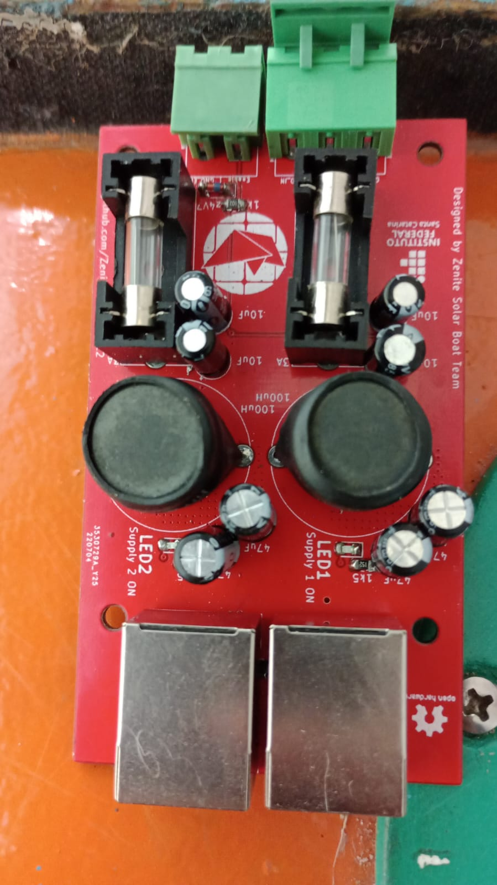
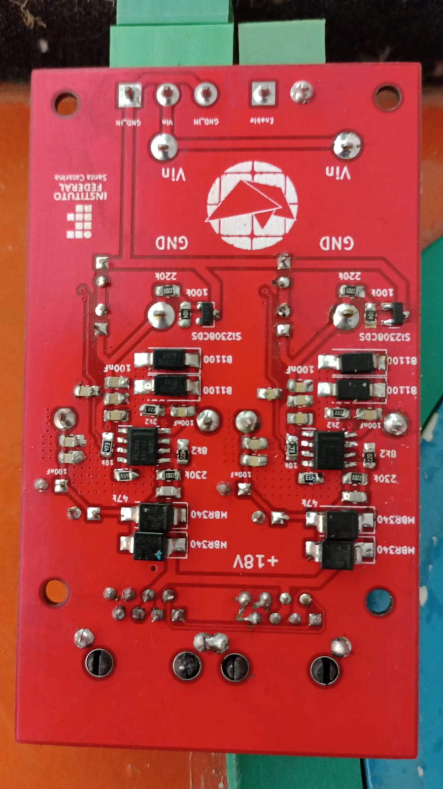
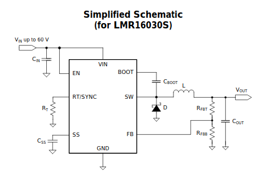
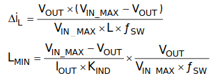

# MFP19
**M**ódulo da **F**onte **P**rincipal 2019  
Embarcação Guarapuvu II  
Equipe Zênite Solar  

### Sobre

Este módulo é responsável por fornecer uma tensao fixa e estavel de 18V para alimentaçao dos modulos que estao na rede CAN

### Images

#### Requisitos e Abordagens
1. Fornecer tensao estavel de 18V 
    - Manter a tensao estavel independente da carga (até 3A)
    - Baixo ripple
2. Ser robusta
    - Nao queimar por curto-circuito
    - Nao queimar por sobre temperatura
    - Nao queimar por sobre-carga
    - Resistencia por ruido eletromagnetico e eletrico causados pelos componentes do sistema (motor,MCC...)
3. Eficiencia energetica.
    -Conversor estatico DC/DC chaveado
4. Facilitar o diagnóstico
    - Utilizar LEDs
    
**CI Ultilizado: Conversor LMR16030**
[Datasheet](https://www.ti.com/lit/ds/symlink/lmr16030.pdf?ts=1596324314390&ref_url=https%253A%252F%252Fwww.google.com%252F)

#### Projeto do Indutor

   -seleção do indutor de saida:

